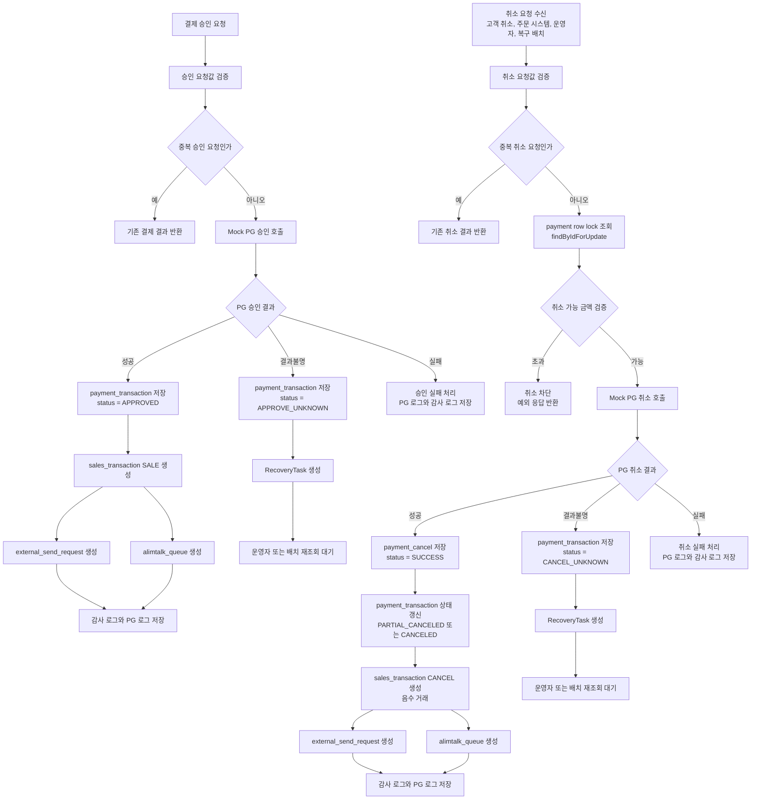
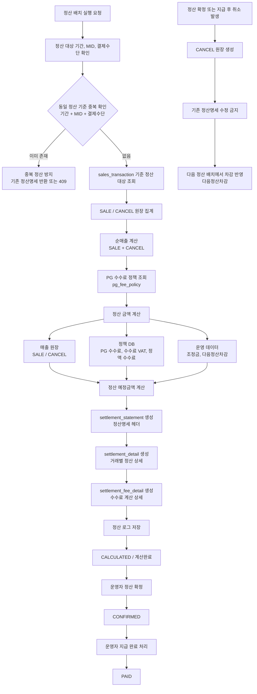

# Yeni Backoffice Portfolio

Spring Boot 기반 결제 운영 백오피스/API 포트폴리오 프로젝트입니다.

이 프로젝트는 실제 PG 운영망에 직접 붙지 않고 Mock PG Adapter를 사용합니다. 다만 내부 비즈니스 로직은 실제 결제 운영에서 발생할 수 있는 중복 요청, 부분취소, 결과불명, 망취소, 매출 원장, 외부전송, 알림톡, 정산 흐름을 고려해 구성했습니다.

PG 승인 성공 후 내부 저장 또는 후속 처리가 실패하는 경우는 운영상 중요한 예외 케이스로 보고, orderNo, tid, idempotencyKey 기준으로 추적 가능한 RecoveryTask를 남기도록 구성했습니다. APPROVE_UNKNOWN, CANCEL_UNKNOWN 상태에서는 SALE/CANCEL 원장을 바로 생성하지 않고, 이후 재조회로 결과가 확정되었을 때 매출 원장과 후속 처리 Queue를 생성합니다.

매출 원장 조회는 대량 데이터에서도 사용할 수 있도록 DB-side paging과 조건 기반 summary 집계를 적용했습니다. 화면의 요약 카드는 현재 페이지 데이터가 아니라 조회 조건 전체 결과를 기준으로 계산합니다.

정산 배치는 동일 정산일과 MID 기준 중복 실행을 방지하고, 확정 또는 지급 완료된 정산명세를 재계산하거나 수정하지 않도록 상태 전이를 제한합니다. 정산 확정 후 발생한 취소는 기존 정산명세를 수정하지 않고 다음정산차감 시나리오로 관리합니다.

## 화면 URL

- 대시보드: `http://localhost:8080/dashboard`
- PG 운영: `http://localhost:8080/admin/payment-operations`
- 매출 원장: `http://localhost:8080/admin/sales-ledger`
- 정산 관리: `http://localhost:8080/admin/settlements`
- DB 명세: `http://localhost:8080/admin/database-spec`
- Swagger UI: `http://localhost:8080/swagger-ui/index.html`

## API 구분

- Mock PG 연동 API: `/api/payment-bridge`
- 관리자 화면용 PG 운영 API alias: `/admin/api/payment-operations`
- 관리자 화면용 매출 원장 API: `/admin/api/sales-ledger`
- 관리자 화면용 정산 API alias: `/admin/api/settlements`
- 관리자 화면용 외부전송 API alias: `/admin/api/external-send`
- 관리자 화면용 알림톡 API alias: `/admin/api/alimtalk`
- 관리자 화면용 복구 작업 API alias: `/admin/api/recovery`

기존 `/api/payment-bridge`, `/api/admin/...`, `/api/admin/settlements` 경로는 호환을 위해 유지하고, 관리자 화면에서는 `/admin/api/...` 경로를 사용합니다.

## 구현 상태

### 1차 구현 완료

- Mock PG 승인/취소
- 중복 승인/취소 방지
- 부분취소 금액 검증
- APPROVE_UNKNOWN / CANCEL_UNKNOWN 결과불명 처리
- RecoveryTask 생성
- SALE/CANCEL 매출 원장
- 외부전송 대기함
- 알림톡 Queue
- 매출 원장 Tabulator 조회
- ErrorCode/requestId/fieldErrors 기반 예외 응답

### 구현 중

- RecoveryTask 운영 재처리 화면
- 정산 수수료 상세 snapshot 고도화
- 정산 후 취소 다음정산차감 시나리오
- 정산 배치 동시 실행 방어

### 확장 예정

- 입점몰 sellerId/orderItemId 기반 셀러별 정산
- 영업일/공휴일 기준 D+N 정산
- 대량 데이터 100만 건 성능 테스트
- 실제 PG/알림톡 외부망 연동

## 결제/취소 처리 흐름



취소 요청은 운영자만 수행하는 것이 아니라 고객 취소, 주문 시스템 자동 취소, 운영자 취소, 복구 배치 등 여러 경로에서 들어올 수 있습니다. 서비스 계층에서는 요청 주체와 관계없이 중복 요청, 취소 가능 금액, 결제 상태를 검증합니다.

APPROVE_UNKNOWN 또는 CANCEL_UNKNOWN 상태에서는 SALE/CANCEL 원장을 바로 생성하지 않고 RecoveryTask로 남깁니다. 이후 재조회로 결과가 확정되면 그때 매출 원장과 후속 처리 Queue를 생성합니다.

## 정산 처리 흐름



정산은 payment_transaction을 직접 집계하지 않고 sales_transaction의 SALE/CANCEL 원장을 기준으로 계산합니다. 매출 원장 금액은 고객 결제/취소 기준 금액이고, 실제 정산 예정금액은 PG 수수료, 수수료 VAT, 정액 수수료, 조정금, 다음정산차감액을 반영해 계산합니다.

PG 수수료율, 수수료 VAT율, 정액 수수료, 정산 주기, 정산 지급일은 정책 DB에서 관리합니다. 조정금은 운영 조정 데이터로 관리하고, 다음정산차감액은 정산 확정 또는 지급 완료 후 발생한 CANCEL 원장을 다음 배치에서 차감하는 방식으로 처리합니다.

## 용어 정리

- SALE 결제매출: PG 승인 성공 후 생성되는 양수 매출 원장
- CANCEL 취소매출: PG 취소 성공 후 생성되는 음수 매출 원장
- 승인 결과불명: PG 승인 요청 결과가 timeout 또는 응답 유실로 확정되지 않은 상태
- 취소 결과불명: PG 취소 요청 결과가 timeout 또는 응답 유실로 확정되지 않은 상태
- RecoveryTask: 결과불명, 망취소, 후속 처리 실패를 추적하고 재처리하기 위한 복구 작업
- 다음정산차감: 정산 확정 또는 지급 완료 후 발생한 취소 거래를 다음 정산 배치에서 차감 반영하는 상태

## 매출 원장

매출 원장은 결제 승인/취소 결과가 확정된 거래만 SALE/CANCEL로 기록합니다. 결제 완료는 SALE 결제매출, 취소 완료는 CANCEL 취소매출 음수 거래로 남기며 원매출은 수정하지 않습니다.

CANCEL 거래에는 원 SALE ID, 결제 ID, 취소 ID, PG 거래번호를 연결합니다. APPROVE_UNKNOWN, CANCEL_UNKNOWN처럼 결과가 불명확한 상태는 매출 원장에 반영하지 않고 RecoveryTask로 추적합니다.

매출 원장 화면은 Tabulator 기반으로 구성되어 영업일, 거래유형, 원장상태, 정산상태, 검색어 필터를 제공합니다. 상단 요약 카드에서는 총 SALE 금액, 총 CANCEL 금액, 순매출, 정산대기, 정산확정, 다음정산차감 건수를 확인할 수 있습니다.

## 예외 처리와 추적

API 예외 응답은 `ErrorCode` 기반으로 표준화했습니다. 검증 실패, 상태 충돌, 중복 요청, 데이터 제약 조건 충돌, 예상하지 못한 서버 오류를 서로 다른 code/status로 구분합니다.

모든 에러 응답에는 `requestId`가 포함됩니다. 클라이언트가 `X-Request-Id` 헤더를 전달하면 해당 값을 사용하고, 없으면 서버에서 UUID를 생성합니다. validation 오류는 `fieldErrors`로 필드명, 메시지, 거절값을 내려줍니다.

예시:

```json
{
  "timestamp": "2026-06-05T09:30:00",
  "status": 400,
  "code": "VALIDATION_ERROR",
  "message": "요청값 검증에 실패했습니다.",
  "path": "/api/payment-bridge/payments/approve",
  "requestId": "REQ-...",
  "fieldErrors": [
    {
      "field": "amount",
      "message": "승인금액은 0보다 커야 합니다.",
      "rejectedValue": "0"
    }
  ]
}
```

## DB 명세

DB 명세 화면에서는 결제, 취소, 매출 원장, 외부전송, 알림톡, 복구 작업, 정산 테이블의 역할과 컬럼 구조를 확인합니다.

주요 unique 방어:

- `payment_transaction`: `orderNo`, `tid`, `approvalRequestKey`
- `payment_cancel`: `cancelRequestKey`
- `sales_transaction`: `sourceType + sourceId`
- `external_send_request`: `requestKey`
- `alimtalk_queue`: `messageKey`
- `payment_recovery_task`: `taskKey`

## 로컬 실행

### 사전 요구사항

- Java 17 이상
- Gradle Wrapper 사용

### 실행

```bash
# Linux/macOS
./gradlew bootRun

# Windows PowerShell
.\gradlew.bat bootRun
```

애플리케이션은 기본적으로 `http://localhost:8080`에서 시작합니다.

## 개발 프로필

### test

H2 File DB를 사용하는 로컬 개발 기본 프로필입니다.

```bash
./gradlew bootRun
```

### local

Docker MySQL/MariaDB 연결을 위한 로컬 프로필입니다.

```bash
./gradlew bootRun --args='--spring.profiles.active=local'
```

### prod

환경변수 기반 운영 배포 프로필입니다.

```bash
export DB_URL="jdbc:mysql://..."
export DB_USERNAME="user"
export DB_PASSWORD="password"
export PORT="8080"
./gradlew bootRun --args='--spring.profiles.active=prod'
```

## 기술 스택

- Java 17
- Spring Boot 3.x
- Spring Data JPA
- Thymeleaf
- Vanilla JavaScript
- Tabulator
- H2 / MySQL
- Gradle

## 포트폴리오 설명 포인트

이 프로젝트는 단순 결제 샘플이 아니라 운영 백오피스에서 자주 확인해야 하는 상태와 후속 흐름을 화면 안에서 추적할 수 있도록 구성했습니다. 결제 승인/취소 이후 매출 원장, 외부전송, 알림톡 Queue, RecoveryTask가 어떻게 연결되는지 보여주는 것이 핵심입니다.

## 보안 및 운영 정보

실제 MID, signKey, 운영 URL, 서버 주소, API 전문, DB 접속 정보는 포함하지 않습니다. 로컬 실행에서는 포트폴리오용 Mock 값을 사용합니다.

## License

Portfolio Project

## Contact

권예은 (Ye Eun Kwon)

- Role: Backoffice / API Developer
- Email: [contact info]

## 결제 운영 신뢰성 부록

[PAYMENT_OPERATION_RELIABILITY.md](PAYMENT_OPERATION_RELIABILITY.md) 문서에서 승인/취소 멱등성, 부분취소 금액 검증, 취소 동시성 잠금, PG 결과불명 복구 작업, 망취소, 외부전송 outbox 분리, SALE/CANCEL append-only 매출 원장 무결성을 정리합니다.
