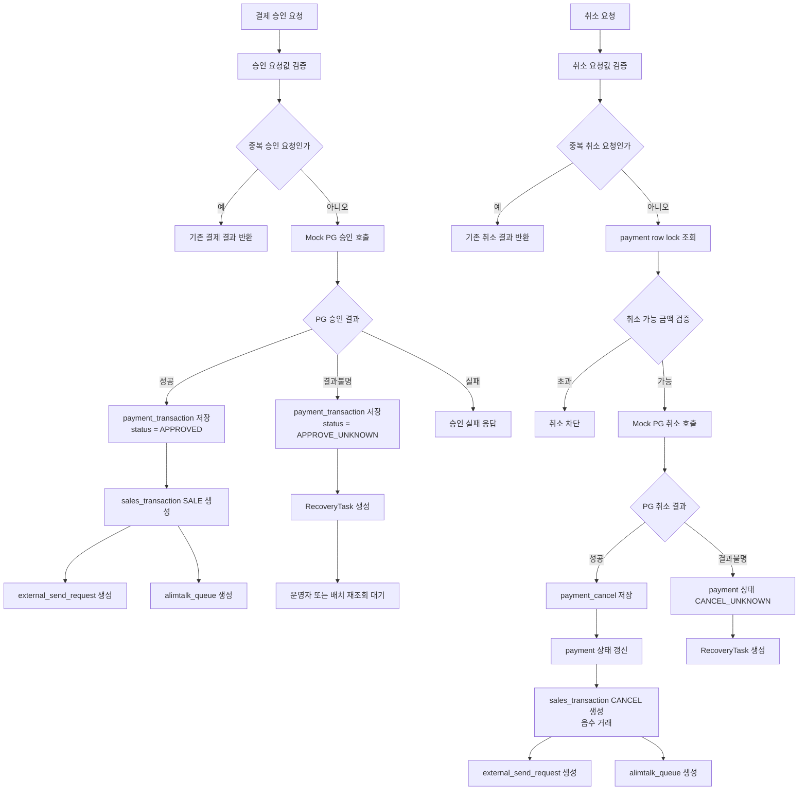
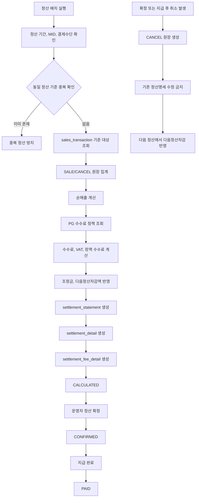

# Yeni Backoffice Portfolio

Spring Boot 기반 결제 운영 백오피스 포트폴리오입니다.

이 프로젝트는 실제 PG 운영망에 직접 붙지 않고 Mock PG Adapter를 사용합니다. 다만 내부 비즈니스 로직은 실제 결제 운영에서 발생할 수 있는 중복 요청, 부분취소, 결과불명, 망취소, 매출 원장, 외부전송, 알림톡, 정산 흐름을 고려해 구성했습니다.

## Demo
[권예은_커머스백오피스_.pdf](https://github.com/user-attachments/files/28837173/_권예은_포트폴리오.pdf)
- Demo: https://yeni-demo.fly.dev/
- PG 운영: https://yeni-demo.fly.dev/admin/payment-operations
- 매출 원장: https://yeni-demo.fly.dev/admin/sales-ledger
- 정산 관리: https://yeni-demo.fly.dev/admin/settlements
- DB 명세: https://yeni-demo.fly.dev/admin/database-spec
- Swagger: https://yeni-demo.fly.dev/swagger-ui/index.html

Fly.io 데모 환경은 H2 in-memory DB를 사용합니다. 배포 또는 Machine 재시작 시 데이터가 초기화될 수 있으며, 데이터가 비어 있으면 PG 운영 화면의 시나리오 버튼으로 다시 생성할 수 있습니다.

## 프로젝트 목표

단순 결제 CRUD가 아니라, 결제 승인 이후 운영 백오피스에서 이어지는 흐름을 하나의 서비스로 확인할 수 있도록 만드는 것이 목표입니다.

주요 흐름은 다음과 같습니다.

1. Mock PG 승인 요청
2. 결제 내역 저장
3. SALE 매출 원장 생성
4. 외부전송 대기함 생성
5. 알림톡 Queue 생성
6. 부분취소 또는 전체취소 요청
7. CANCEL 음수 매출 원장 생성
8. 결과불명 발생 시 RecoveryTask 생성
9. 매출 원장 기준 정산 명세 생성

## 핵심 시나리오

### 정상 승인

PG 승인 성공 후 `payment_transaction`에 결제 내역을 저장하고, 확정된 승인 거래만 `sales_transaction`에 SALE 결제매출로 기록합니다. 이후 외부전송 대기함과 알림톡 Queue를 생성해 결제 이후 후속 처리 흐름을 확인할 수 있습니다.

### 부분취소

부분취소 요청 시 기존 결제의 취소 가능 금액을 검증합니다. 취소가 확정되면 `payment_cancel`을 생성하고, 원 SALE 거래를 수정하지 않고 `sales_transaction`에 CANCEL 취소매출을 음수 거래로 남깁니다.

### 중복 요청 방어

승인 요청과 취소 요청은 request key와 DB unique constraint를 기준으로 중복 생성을 방어합니다. 같은 승인 또는 취소 요청이 반복되어도 결제와 원장이 중복 생성되지 않도록 설계했습니다.

### 결과불명과 복구 작업

PG 응답이 명확하지 않은 경우 승인 결과불명은 `APPROVE_UNKNOWN`, 취소 결과불명은 `CANCEL_UNKNOWN` 상태로 남기고 RecoveryTask를 생성합니다. 결과가 확정되기 전에는 SALE/CANCEL 원장을 만들지 않아 정산 대상에 잘못 포함되지 않도록 했습니다.

### 망취소

PG 승인 성공 후 내부 저장 또는 후속 처리에서 장애가 발생할 수 있는 상황을 고려했습니다. 이런 경우 운영자가 확인할 수 있도록 복구 작업을 남기고, 필요한 경우 망취소가 필요한 상태로 추적할 수 있게 구성했습니다.

### 정산

정산은 payment 테이블을 직접 집계하지 않고 SALE/CANCEL 매출 원장을 기준으로 계산합니다. 매출 원장 금액에서 PG 수수료, 수수료 VAT, 정액 수수료, 조정금, 다음정산차감액을 반영해 정산 예정금액을 계산합니다.

## 결제/취소 처리 흐름



취소 요청은 고객 취소, 주문 시스템 자동 취소, 운영자 취소, 복구 배치 등 여러 경로에서 들어올 수 있습니다. 서비스 계층에서는 요청 주체와 관계없이 중복 요청, 취소 가능 금액, 결제 상태를 검증합니다.

`APPROVE_UNKNOWN` 또는 `CANCEL_UNKNOWN` 상태에서는 SALE/CANCEL 원장을 바로 생성하지 않습니다. 이후 재조회로 결과가 확정되면 그때 매출 원장과 후속 처리 Queue를 생성합니다.

## 정산 처리 흐름



정산의 기준 데이터는 결제 테이블이 아니라 매출 원장입니다. 결제 승인은 SALE 결제매출, 취소 확정은 CANCEL 취소매출로 기록하고, 정산 배치는 이 원장 데이터를 기준으로 수수료와 조정금을 반영합니다.

## 용어 정리

- SALE 결제매출: PG 승인 성공 후 생성되는 양수 매출 원장
- CANCEL 취소매출: PG 취소 성공 후 생성되는 음수 매출 원장
- 승인 결과불명: PG 승인 요청 결과가 timeout 또는 응답 유실로 확정되지 않은 상태
- 취소 결과불명: PG 취소 요청 결과가 timeout 또는 응답 유실로 확정되지 않은 상태
- RecoveryTask: 결과불명, 망취소, 후속 처리 실패를 추적하고 재처리하기 위한 복구 작업
- 다음정산차감: 정산 확정 또는 지급 완료 후 발생한 취소 거래를 다음 정산 배치에서 차감 반영하는 상태

## 데이터 무결성 포인트

주요 중복 방어는 서비스 로직과 DB unique constraint를 함께 사용합니다.

- `payment_transaction`: 주문번호, PG 거래번호, 승인 요청키 중복 방어
- `payment_cancel`: 취소 요청키 중복 방어
- `sales_transaction`: sourceType + sourceId 기준 SALE/CANCEL 원장 중복 방어
- `external_send_request`: requestKey 기준 외부전송 중복 방어
- `alimtalk_queue`: messageKey 기준 알림톡 Queue 중복 방어
- `payment_recovery_task`: taskKey 기준 복구 작업 중복 방어

## 예외 응답과 추적

API 예외 응답은 `ErrorCode`, `requestId`, `fieldErrors` 기반으로 표준화했습니다. 검증 실패, 상태 충돌, 중복 요청, 데이터 제약 조건 충돌, 서버 오류를 서로 다른 code/status로 구분하고, 화면과 로그에서 같은 requestId로 추적할 수 있게 구성했습니다.

## 화면 구성

- `/dashboard`: 포트폴리오 프로젝트 목록과 상세 팝업
- `/admin/payment-operations`: Mock PG 승인, 취소, 결과불명, 망취소 시나리오 실행
- `/admin/sales-ledger`: SALE/CANCEL 매출 원장 조회와 상세 확인
- `/admin/settlements`: 매출 원장 기준 정산 명세 생성과 상태 확인
- `/admin/database-spec`: 결제, 취소, 매출 원장, 외부전송, 알림톡, 복구 작업, 정산 테이블 명세
- `/swagger-ui/index.html`: REST API 문서

## 구현 상태

### 1차 구현 완료

- Mock PG 승인/취소
- 중복 승인/취소 방지
- 부분취소 금액 검증
- `APPROVE_UNKNOWN` / `CANCEL_UNKNOWN` 결과불명 처리
- RecoveryTask 생성
- SALE/CANCEL 매출 원장
- 외부전송 대기함
- 알림톡 Queue
- 매출 원장 Tabulator 조회
- ErrorCode/requestId/fieldErrors 기반 예외 응답
- Fly.io 데모 배포

### 구현 중

- RecoveryTask 운영 재처리 화면
- 정산 수수료 상세 snapshot 고도화
- 정산 후 취소 다음정산차감 시나리오
- 정산 배치 동시 실행 방어
- 대량 데이터 기준 매출 원장 summary DB 집계 최적화

### 확장 예정

- 입점몰 sellerId/orderItemId 기반 셀러별 정산
- 영업일/공휴일 기준 D+N 정산
- 대량 데이터 100만 건 성능 테스트
- 실제 PG/알림톡 외부망 연동
- 운영자 권한과 감사 로그

## 기술 스택

- Java 17
- Spring Boot 3
- Spring Data JPA
- Thymeleaf
- Vanilla JavaScript
- Tabulator
- H2 / MySQL
- Gradle
- Fly.io

## 로컬 실행

```powershell
.\gradlew.bat bootRun
```

기본 접속 주소:

```text
http://localhost:8080/
http://localhost:8080/admin/payment-operations
```

## 빌드

```powershell
.\gradlew.bat clean build
```

## Fly.io 배포

```powershell
fly auth login
fly deploy --remote-only
```

현재 데모는 첫 접속 지연을 줄이기 위해 Machine 자동 중지를 끄는 방향으로 설정했습니다.

```toml
auto_stop_machines = "off"
min_machines_running = 1
```

이 설정은 유휴 상태에서도 Machine을 계속 실행하므로 비용이 늘 수 있습니다. 비용 절감이 더 중요하면 `auto_stop_machines = "stop"` 또는 `"suspend"`, `min_machines_running = 0`으로 되돌릴 수 있습니다.

## 운영 환경 주의사항

현재 Fly.io 데모는 포트폴리오 확인용입니다. 실제 운영 환경에서는 다음 보강이 필요합니다.

- H2 대신 PostgreSQL 또는 MySQL 사용
- 관리자 인증/인가 적용
- PG callback signature 검증
- IP allowlist 및 CORS 제한
- CSRF 방어
- 정산 배치 중복 실행 방어
- RecoveryTask 운영 재처리 화면 고도화

## 보조 스크립트

```powershell
.\scripts\setup-fly.ps1
.\scripts\deploy-fly.ps1
.\scripts\check-fly.ps1 -BaseUrl "https://yeni-demo.fly.dev"
```

## License

Portfolio Project
