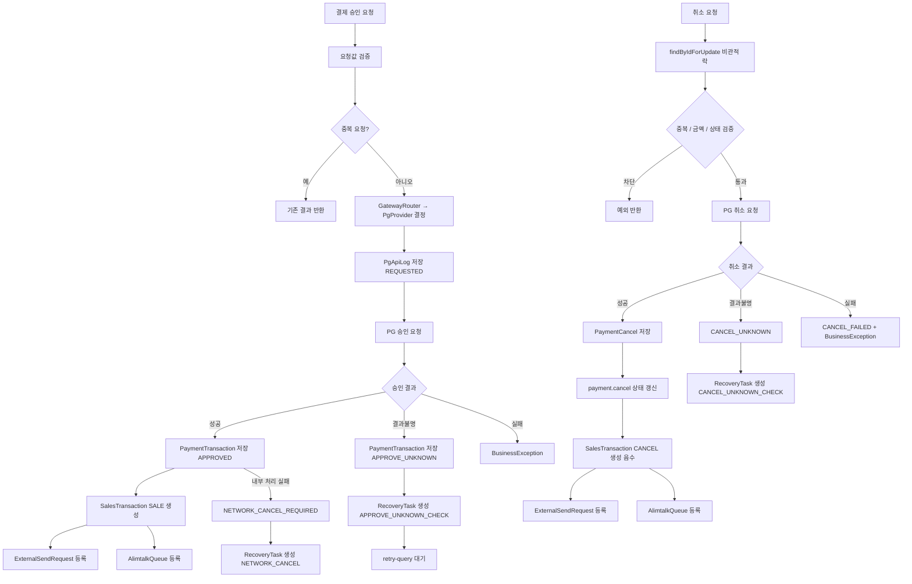
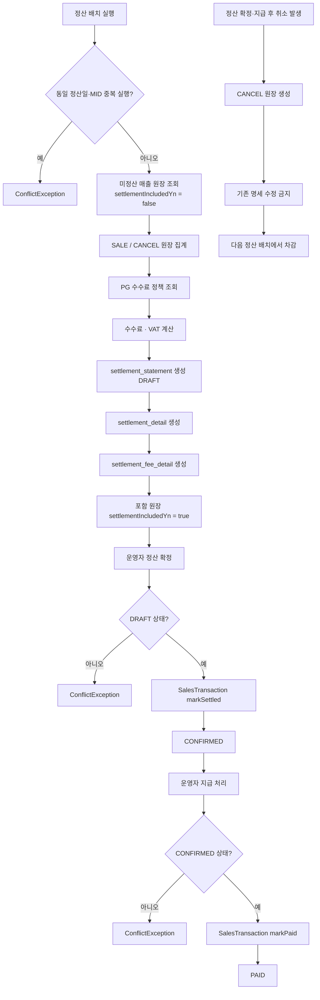

# Yeni Backoffice Portfolio

Spring Boot 기반 결제 운영 백오피스 포트폴리오입니다.

실제 PG 운영망에 직접 붙지 않고 Mock PG Gateway를 사용하지만, 내부 비즈니스 로직은 실제 결제 운영에서 발생하는 중복 요청 방어, 부분취소, 결과불명, 망취소, 매출 원장, 외부전송, 알림톡, 정산 흐름을 고려해 구성했습니다.

## Demo

- 대시보드: https://yeni-demo.fly.dev/
- PG 운영: https://yeni-demo.fly.dev/admin/payment-operations
- 매출 원장: https://yeni-demo.fly.dev/admin/sales-ledger
- 정산 관리: https://yeni-demo.fly.dev/admin/settlements
- DB 명세: https://yeni-demo.fly.dev/admin/database-spec
- Swagger: https://yeni-demo.fly.dev/swagger-ui/index.html

> Fly.io 데모는 H2 in-memory DB를 사용합니다. Machine 재시작 시 데이터가 초기화되며, 비어 있으면 PG 운영 화면의 시나리오 버튼으로 다시 생성할 수 있습니다.

## 프로젝트 목표

단순 결제 CRUD가 아니라, 결제 승인 이후 운영 백오피스에서 이어지는 흐름 전체를 하나의 서비스로 확인할 수 있도록 만드는 것이 목표입니다.

1. Mock PG 승인 요청
2. 결제 내역 저장
3. SALE 매출 원장 생성
4. 외부전송 대기함 등록
5. 알림톡 Queue 등록
6. 부분취소 또는 전체취소
7. CANCEL 음수 매출 원장 생성
8. 결과불명 발생 시 RecoveryTask 생성 및 재조회
9. 매출 원장 기준 정산 명세 생성, 확정, 지급 처리

## 결제 프로세스

### 승인 흐름

```
요청 진입
  ├─ 중복 방지 키 / orderNo 기존 결제 존재? → 기존 결과 반환 (IDEMPOTENT_REPLAY)
  │
  ├─ GatewayRouter → PgProvider 결정
  ├─ PgApiLog 저장 (REQUESTED)
  ├─ PG 승인 요청
  │
  ├─ 결과불명 (unknown)
  │    ├─ PaymentTransaction 저장 (APPROVE_UNKNOWN)
  │    └─ RecoveryTask 생성 (APPROVE_UNKNOWN_CHECK)
  │
  ├─ 승인 실패 → BusinessException
  │
  └─ 승인 성공
       ├─ PaymentTransaction 저장 (APPROVED)
       ├─ SalesTransaction 생성 (SALE, 양수)
       ├─ ExternalSendRequest 등록
       ├─ AlimtalkQueue 등록
       │
       └─ 내부 처리 실패 시 (망취소 경로)
            ├─ PaymentStatus → NETWORK_CANCEL_REQUIRED
            └─ RecoveryTask 생성 (NETWORK_CANCEL)
```

### 취소 흐름

```
요청 진입 (paymentId + cancelAmount + idempotencyKey)
  ├─ findByIdForUpdate (비관적 락 — 동시 취소 방지)
  ├─ 중복 방지 키 기존 취소 존재? → 기존 결과 반환
  ├─ CANCEL_UNKNOWN 복구 태스크 존재? → 기존 결과 반환
  ├─ isCancelCompleted() → ConflictException
  ├─ cancelAmount > getCancelableAmount() → ValidationException
  │
  ├─ PG 취소 요청
  │
  ├─ 결과불명
  │    ├─ PaymentStatus → CANCEL_UNKNOWN
  │    └─ RecoveryTask 생성 (CANCEL_UNKNOWN_CHECK)
  │
  ├─ 취소 실패
  │    ├─ PaymentStatus → CANCEL_FAILED
  │    └─ BusinessException
  │
  └─ 취소 성공
       ├─ cancelAmount == getCancelableAmount()? → FULL : PARTIAL
       ├─ payment.cancel(amount) — canceledAmount 누적, paymentStatus 갱신
       ├─ PaymentCancel 저장
       ├─ SalesTransaction 생성 (CANCEL, 음수)
       ├─ ExternalSendRequest 등록
       └─ AlimtalkQueue 등록
```

### PaymentStatus 상태 전이

```
                    승인 요청
                       │
              ┌────────┴────────┐
           success           unknown
              │                 │
           APPROVED      APPROVE_UNKNOWN
              │                 │
         취소 요청         retry-query 성공
              │                 │
    ┌─────────┼──────┐       APPROVED
 partial    full  unknown
    │         │      │
PARTIAL_  CANCELED  CANCEL_
CANCELED            UNKNOWN
```



## 정산 프로세스

### 상태 전이

```
DRAFT → CONFIRMED → PAID
```

| 단계 | 트리거 | 처리 내용 |
|------|--------|-----------|
| **DRAFT** | 운영자가 배치 실행 | `settlementIncludedYn = false` 매출 원장 집계, 수수료/VAT 계산, 명세 생성 |
| **CONFIRMED** | 운영자가 정산 확정 | DRAFT 상태 검증 → SalesTransaction 전체 `markSettled()` → 이후 수정 불가 |
| **PAID** | 운영자가 지급 처리 | CONFIRMED 상태 검증 → SalesTransaction 전체 `markPaid()` |

- 동일 정산일 + MID 기준 중복 배치 실행은 `ConcurrentHashMap` 인메모리 락과 DB unique constraint로 이중 방어
- `settlementIncludedYn = true` 처리로 같은 매출 원장이 다음 배치에서 중복 집계되는 것을 방지
- 정산 확정 또는 지급 완료 후 발생한 취소는 기존 명세를 수정하지 않고 다음 정산 배치에서 차감



### SalesTransaction.settlementStatus 변화

| 타이밍 | settlementStatus |
|--------|-----------------|
| 매출 발생 | `NOT_SETTLED` |
| 배치에 포함됨 | `CALCULATED` |
| 정산 확정 | `SETTLED` |
| 지급 처리 | `PAID` |

## 서비스 계층 구조

```
PaymentApproveService   — 승인, StdPay 준비/처리
PaymentCancelService    — 취소 (Bridge / 직접)
PaymentQueryService     — 재조회, 결제 목록/상세/로그
PaymentNotificationService  — ExternalSendRequest / AlimtalkQueue 생성
PaymentRecoveryService  — RecoveryTask 생성 및 성공 처리
PaymentRecoveryOperationService — RecoveryTask 운영 조회 / 재시도 / 수동 확정
SalesLedgerService      — 매출 원장 조회 / 상세 링크
SettlementOperationService  — 정산 배치 실행 / 확정 / 지급 처리
SettlementBatchProcessor    — 정산 계산 로직 (REQUIRES_NEW 격리)
PaymentAuditHelper      — PgApiLog / AuditLog 저장 공통 유틸
```

단일 서비스(`PaymentOperationService`)에 집중되던 777줄·14 의존성을 책임 기준으로 분리했습니다.

## 데이터 무결성

중복 방어는 서비스 로직과 DB unique constraint를 함께 사용합니다.

| 테이블 | unique 키 |
|--------|-----------|
| `payment_transaction` | orderNo, tid, approvalRequestKey |
| `payment_cancel` | cancelRequestKey |
| `sales_transaction` | sourceType + sourceId |
| `external_send_request` | requestKey |
| `alimtalk_queue` | messageKey |
| `payment_recovery_task` | taskKey |

## 예외 응답

모든 API 예외는 `ErrorCode`, `requestId`, `fieldErrors` 구조로 표준화되어 있습니다. 화면과 서버 로그에서 같은 `requestId`로 추적할 수 있습니다.

| 상황 | HTTP Status |
|------|-------------|
| 요청값 검증 실패 | 400 |
| 상태 충돌 (이미 취소됨 등) | 409 |
| 리소스 없음 | 404 |
| 비즈니스 규칙 위반 | 422 |
| 서버 오류 | 500 |

## 화면 구성

| 경로 | 설명 |
|------|------|
| `/dashboard` | 포트폴리오 프로젝트 목록과 상세 팝업 |
| `/admin/payment-operations` | Mock PG 승인·취소·결과불명·망취소 시나리오 실행 |
| `/admin/sales-ledger` | SALE/CANCEL 매출 원장 조회 및 상세 |
| `/admin/settlements` | 정산 명세 생성·확정·지급 처리 |
| `/admin/database-spec` | 전체 테이블 명세 |
| `/swagger-ui/index.html` | REST API 문서 |

## 용어

| 용어 | 설명 |
|------|------|
| SALE 결제매출 | PG 승인 성공 후 생성되는 양수 매출 원장 |
| CANCEL 취소매출 | PG 취소 성공 후 생성되는 음수 매출 원장 |
| 승인 결과불명 | PG 승인 응답이 timeout 또는 유실로 확정되지 않은 상태 |
| 취소 결과불명 | PG 취소 응답이 timeout 또는 유실로 확정되지 않은 상태 |
| RecoveryTask | 결과불명·망취소·후속 처리 실패를 추적하고 재처리하는 복구 작업 |
| 망취소 | PG 승인 성공 후 내부 처리 실패 시 PG에 취소를 요청하는 보상 트랜잭션 |
| 다음정산차감 | 정산 확정 후 발생한 취소를 다음 배치에서 차감 반영하는 처리 |

## 기술 스택

- Java 17, Spring Boot 3
- Spring Data JPA, Thymeleaf
- Vanilla JavaScript, Tabulator
- H2 (로컬/데모) / MySQL (운영)
- Gradle 멀티모듈 (`api` / `core`)
- Fly.io

## 로컬 실행

```powershell
.\gradlew.bat bootRun
# http://localhost:8080/
```

## 빌드

```powershell
.\gradlew.bat clean build
```

## Fly.io 배포

```powershell
fly auth login
fly deploy --remote-only
```

> 현재 데모는 `auto_stop_machines = "off"`, `min_machines_running = 1`로 설정해 첫 접속 지연을 없앴습니다.

## 운영 환경 주의사항

포트폴리오 확인용 데모이며, 실제 운영 환경에서는 다음 보강이 필요합니다.

- H2 대신 PostgreSQL 또는 MySQL 사용
- 관리자 인증/인가 적용
- PG callback signature 검증
- IP allowlist 및 CORS 제한
- CSRF 방어

## License

Portfolio Project
